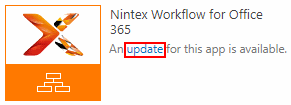
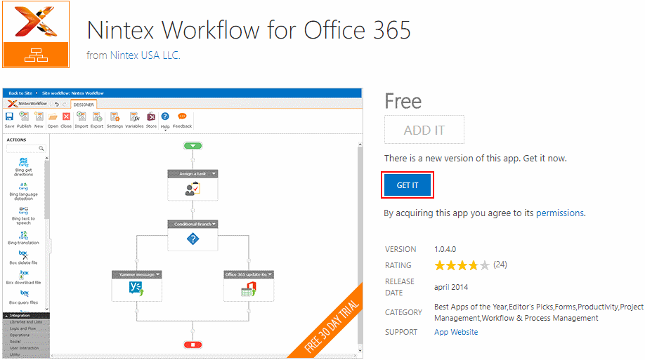
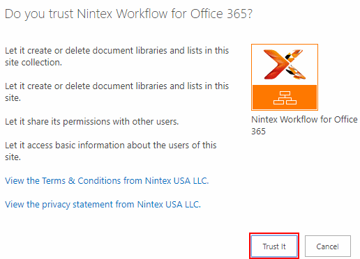

# SharePointAddInsAutomation

Use SharePointAddInsAutomation to automate add-in updates across site
collections.

Below we outline how to first identify SharePoint add-ins using
[SPReports](https://github.com/ronnieholm/Bugfree.SharePoint.DiagnosticTools/tree/master/src/SPReports). The
output is a CSV report containing add-ins installed across the
tenant. Next this CSV is fed into SharePointAddInsAutomation to
automate the add-in updating. Unfortunately, no API for updating is
provided by Microsoft, so we fall back to browser automation.

We use [migrating Nintex to a local
datacenter](https://community.nintex.com/docs/DOC-3921) -- one closer
to where the SharePoint Online tenant is hosted -- as the running
example. The migration is preconditioned on Nintex Workflow and Nintex
Forms add-ins being current.

Identifying add-ins with SPReports and updating add-ins with
SharePointAddInsAutomation works with any add-in. That's because
SharePoint's dialogs for updating add-ins are independent of the
specific add-in.

## Identifying which add-ins are installed where

Add-ins are installed on a per web basis so to identify which add-ins
are installed where, every web needs to be recursively searched and
any add-in instance reported. The
[SPReports](https://github.com/ronnieholm/Bugfree.SharePoint.DiagnosticTools/tree/master/src/SPReports)
tool does exactly this:

    .\SPReports.exe --dump-metadata
                    --username rh@bugfree.onmicrosoft.com
                    --password secret
                    --tenant-name bugfree
                    --ouptput-path .\dump.bin
    .\SPReports.exe --webs-add-ins
                    --input-path .\dump.bin
                    --output-path .\webs-add-ins.csv

Dumping the metadata might take hours depending on the size of the
tenant. When it's done, the
[webs-add-ins.csv](Webs-add-ins-sample.csv) file contains the
following columns of interest to SharePointAddInsAutomation:

- *Id*. Unique to every installed add-in instance.
- *WebUrl*. Url of the form https://bugfree.sharepoint.com/sites/test denoting the web on which
the add-in is installed.
- *Title*. For Nintex, it either reads "Nintex Workflow for Office 365" or "Nintex Forms
for Office 365". Those values come in handy when filtering add-ins.
- *Version*. Only applicable to Nintex add-ins which expose the version as a custom property.
In general, for Nintex-add-ins, the API provides no way to get at the version displayed in the UI.

Thus, now we can filter the Webs-add-ins.csv for Nintex Workflow and
Nintex Forms add-ins not in current versions.

## Updating add-ins using browser automation

Given that no API exists for updating add-ins, and that performing a
manual update on each web is both click intensive and time consuming,
automation is called for. The approach taken is to automate the manual
steps listed below by remote controlling the browser:

1. Given a WebUrl such as https://bugfree.sharepoint.com/sites/test,
   navigate to the Site Contents application layout page by appending
   /_layouts/15/viewlsts.aspx to WebUrl.

   

   The update link contains the Id of the add-in instance, making the
   link easy to identify among possibly multiple update links on the
   page.

2. Upon clicking the update link, a dialog is displayed:

   

   On the dialog, we click the GET IT button.

3. Upon clicking the GET IT button, another dialog appears for us to
   trust the add-in:

   

   On the dialog, we click the Trust It button which closes both
   dialogs and takes us back to the Site Contents page where the
   add-in starts updating.

To remote control the browser, we use
[Canopy](https://lefthandedgoat.github.io/canopy), an API build on top
of [Selenium](http://www.seleniumhq.org). Selenium in turn abstracts
away the browser details through drivers, such that our automation
logic is browser neutral.

## Compiling and running

Requires Visual Studio 2017 with F# language support.

To run SharePointAddInsAutomation, change the variables marked as such
at the top of Program.fs. Next either re-compile and run the
executable or run the code in F# interactive.

## Supported platforms

SharePoint on-premise and SharePoint Online.

## Contact

Open an issue on this repository or drop me a line at mail@bugfree.dk.