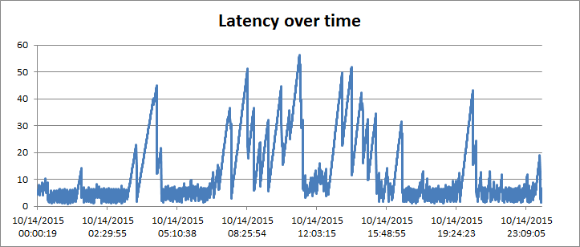
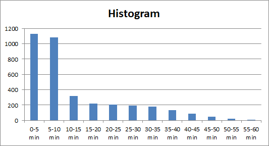
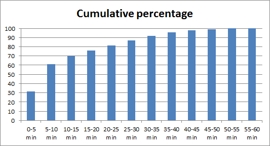

SPSearchIndexLiveliness
=======================

When to use it
--------------

Measuring the liveliness of SharePoint's search index is particularly important 
when developing search-driven applications. Especially since liveliness varies 
over time. With SPSearchIndexLiveliness, any SharePoint user with write access 
to a list can continuously measure how far behind the index is from content.

How to use it
-------------

After compiling the solution, create a generic list anywhere visited by the 
crawler. Then run SPSearchIndexLiveliness as follows (username and password are 
for SharePoint Online only):

```
# SPSearchIndexLiveliness.exe webUrl listTitle pingInterval [username] [password]
%> .\SPSearchIndexLiveliness.exe https://bugfree.sharepoint.com/sites/liveliness Pings 30 rh@bugfree.onmicrosoft.com password | tee Log.txt
```

This causes SPSearchIndexLiveliness to continuously print liveliness statistics
to the terminal and Log.txt.

Example output running against SharePoint Online:

```
Run     Replies    Current time           Most recent reply      Latency
4427	6258	   10/14/2015 00:00:19	  10/13/2015 23:55:55	 00:04:24
4428	6258	   10/14/2015 00:00:39	  10/13/2015 23:55:55	 00:04:44
4429	6258	   10/14/2015 00:00:58	  10/13/2015 23:55:55	 00:05:03
4430	6258	   10/14/2015 00:01:17	  10/13/2015 23:55:55	 00:05:22
4431	6258	   10/14/2015 00:01:34	  10/13/2015 23:55:55	 00:05:39
4432	6258	   10/14/2015 00:01:52	  10/13/2015 23:55:55	 00:05:57
4433	6258	   10/14/2015 00:02:11	  10/13/2015 23:55:55	 00:06:16
4434	6258	   10/14/2015 00:02:29	  10/13/2015 23:55:55	 00:06:34
4435	6258	   10/14/2015 00:02:51	  10/13/2015 23:55:55	 00:06:56
...
```

To help diagnose operational issues with search and/or your application, Log.txt
could be imported into a spreadsheet for further processing.

As an example, 24-hour statistics for October 14, 2015 has been imported into 
[SharePoint-Online-latency-example.xlsx](SharePoint-Online-latency-example.xlsx)
and a latency over time graph produced. Given that SharePoint Online has continous 
crawl enabled by default, performance during business hours is sub-optimal:



The minimum, maximum, and average latencies are 0.87, 56.43, and 12.93 minutes,
respectively.

Constructing a histogram from the 3,612 measurements gives a feel for the distribution 
of data. Assuming data is representative, the histogram is useful for defining
latency requirements:


 
From the histogram, we can derive the cumulative percentage of measurements:



Interacting with a queing-based system like SharePoint Search, requirements are 
best phrased (and verified) in terms of percentages and latency. For intance, from
the cumulative percentages, a reasonable requirement might be that "80% of search 
requests must show content no older than 25 minutes".

In principle, we can only get to "100% of search requests ..." by accepting an 
infinite latency. Queing-based (asynchronous) systems are generally build to scale 
better than request/reply-based (synchronous) systems. Forcing an asynchronous 
system to operate in synchronous mode generally leads to bad performance.

How it works
------------

Each ping interval around, SPSearchIndexLiveliness adds an item to a list and 
queries the list using SharePoint Search. As the search result contains all 
indexed list elements, latency is computed as the difference between current 
time and creation time of the most recent item returned by search.

Supported platforms
-------------------

SharePoint 2013 on-prem and SharePoint Online.